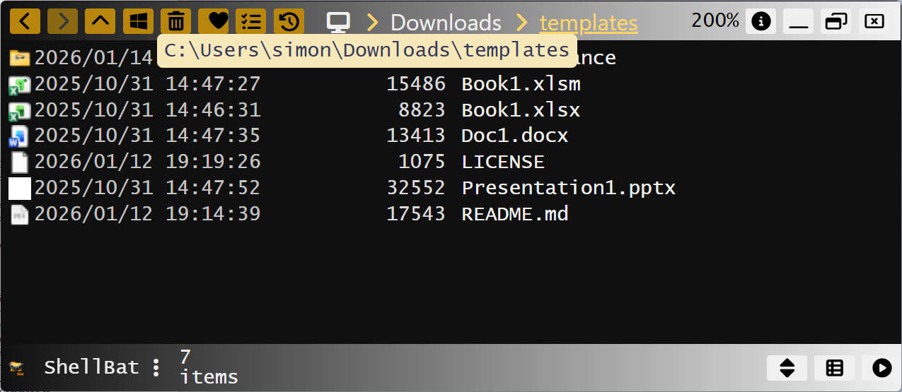
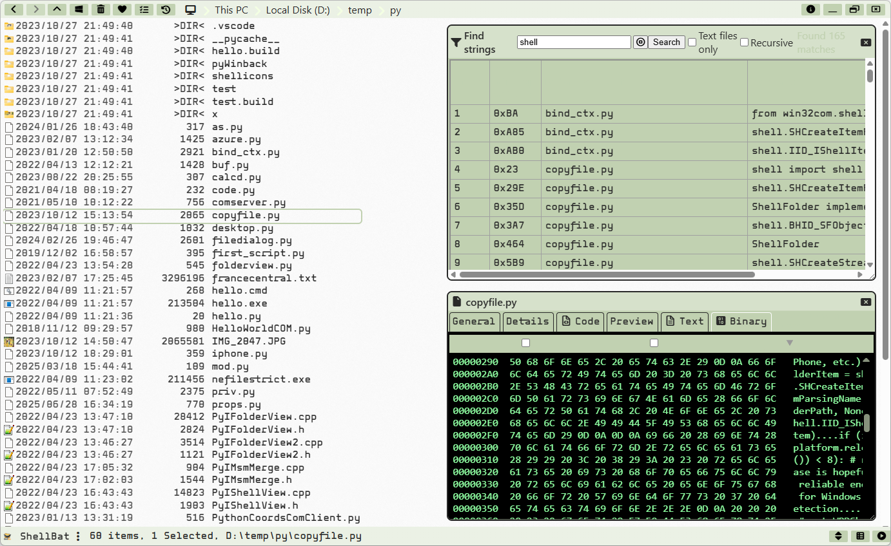
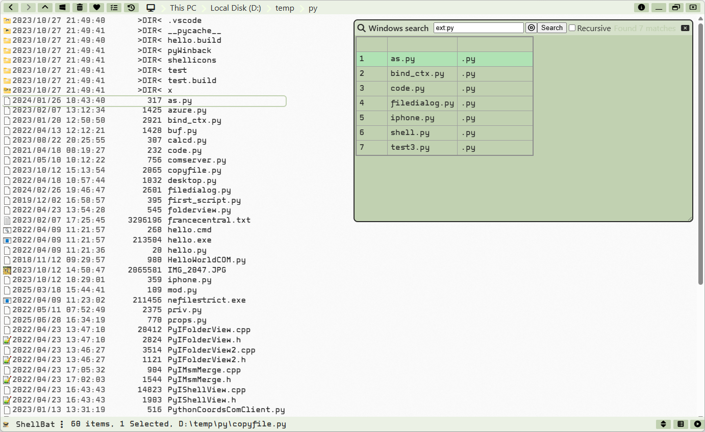
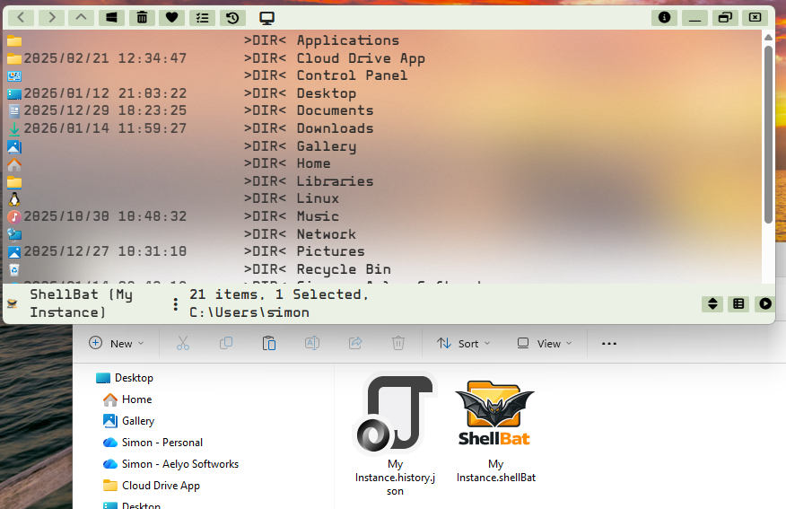

<p align="center"></p>

**A modern Windows file explorer with file viewers, multi-instance workflows, terminal integration, search capabilities, and deep Windows Shell interoperability.**


This screenshot represents ShellBat's main window showcasing its integrated terminal and file browsing capabilities, running [Midnight Commander for Windows](https://github.com/adamyg/mcwin32).

ShellBat is designed for power users who want flexibility, and a rich set of tools directly integrated into a single file (yes, *just one unique ShellBat.exe file*) application—while still offering a clean UX that works out-of-the-box without configuration.
Developers benefit from its advanced viewers, Monaco-powered editor, binary inspection, raw string (ansi, unicode) search and Windows AQS Search.

It supports x64, x86 and ARM64 Windows 10 and higher and only requires the WebView2 runtime (preinstalled on most systems).
It works fine in Windows Sandbox (WebView2 must be installed), Hyper-V VMs, and other virtual environments.

# 🧭 Navigation
ShellBat provides multiple navigation paradigms:

### **Mouse and Keyboard**
- Full keyboard navigation and shortcuts.
- Mouse support with context menus, drag-and-drop, and selection.
- Selection modes: single, multi (Ctrl), range (Shift).

### **Breadcrumb Navigation**
- Classic address bar breadcrumbs let you jump quickly across folder levels.
- Hover over breadcrumb arrows to reveal *sibling directories*, allowing  fast sideways navigation.
- Click the Desktop icon to return instantly to the Windows Shell root namespace.
- The opened folder can be opened in Windows Explorer using the Windows icon of the breadcrumb bar.


### **Direct Path Entry**
- Press F6 or double-click the address field in upper left to enter any path directly.
- Supports absolute paths and special shell paths (e.g. `::{CLSID}`).


### **History Navigation**
- Full backward/forward history stack.
- “Back to…” and “Forward to…” menus display complete history lists.
- History is automatically saved. It can be saved per instance if configured (see Instancing chapter below).

### **Open From Explorer Instances**
ShellBat can navigate to a folder from any open Windows Explorer instance on the Desktop, using the "Open From Explorer" context menu item.
Here is an example of ShellBat proposing to open one of two folders from Explorer instances (`d:\temp\x` and `d:\sql`):


### **Open From Visual Studio Instances**
Similarly, ShellBat can navigate to a folder from any open Visual Studio instance (solution) on the Desktop, using the "Open From Visual Studio" context menu item.
Here is an example of ShellBat proposing to open detected folders:

- Solution folders
- Project folders
- Project build output folders


ShellBat is here using the VT323 theme :-)

### **Compressed Files**
ShellBat supports navigating inside compressed archive files as virtual folders for Shell items of .7z, .gz, .bz2, .tar, .rar, .tgz, .tbz2, .tzst, .txz, .zst, .xz types.

It also works for a number of well-known compressed image formats such as nupkg, .docx, .xlsx, .xlsm (more extensions may be added in the future) but you must use the "Open as Folder" menu item:


### **Namespace Extensions**
Full support for navigating through custom namespace extensions, Desktop, Recycle Bin, This PC, virtual folders, and custom shell extensions, like Apple iPhone.


> [!NOTE]
> Disk drives are displayed with their volume label, size and free space when available.

### **Export as .CSV**
Users can export the current folder's content list as a .CSV file for further analysis or reporting.
The file will be opened directly after export, which usually launches Microsoft Excel or the default CSV viewer.


# 🔅 Global Zoom

The view dynamically adapts to scaling, including high-DPI displays. Zooming (250% in the screenshot) can be adjusted with Ctrl + Mouse Wheel (only in Details-mode view).

# 🧩 Views & Layout

## **Items View**
Users can:

- Exclude files or folders from the view.
- Toggle hidden/system files visibility.
- Display icons vs thumbnails (generally requires more processing) in details view.
- Customize sorting (this is volontarily simple, no complex grouping, etc.).
- Choose between Details and Images views.


### **Inline Filter**
- Begin typing and ShellBat automatically opens a filtering input.
- Matching items are highlighted (here in yellow), and the filter updates in real time.
- Works in both Details and Images views.


## **Images View**

Image-mode view includes:
- Images files rendered as thumbnails, including SVG files.
- Video files rendered as thumbnails.
- PDF first page rendered as image (uses more processing).
- Square thumbnails mode for uniform grids.
- Adjustable thumbnail size. Note in Images view this can be changed dynamically with Ctrl + Mouse Wheel, while anywhere else it's used to zoom in or out the whole app.
- Optional title display.

**Thumbnails:**
- All thumbnails are rendered by the integrated WebView or using Windows Imaging Component (WIC) for maximum compatibility and performance, so all files you can see in Explorer are supported.
- Video thumbnails are generated using Windows Shell APIs.
- .SVG files are also supported natively without installing any additional software.

In the screenshot below, ShellBat is displaying a .HEIC image, which requires WIC codecs (which are available depending on your Windows version and your setup).


**Square Thumbnails Example:**


Perfect for photographers, designers, and anyone who prefers consistent visual grids.

**Without Title:**

Allows rapid browsing of image sets in a dense, scrollable layout.

**PDF Files as Images:**


# 🧰 Context Menu & Shell Integration
ShellBat includes an embedded context menu that allows access to standard Windows Shell actions as well as ShellBat-specific tools.
It can be accessed by right-clicking any item. Available actions:
- Open (with default registered application)
- Open with any registered application
- Copy, Cut, Paste, Paste as Shortcut
- Recycle, Delete
- Rename
- Unblock (Mark-of-the-Web removal)
- Open link target (for shortcuts)
- Mount / Eject (for disk images)
- Zip files as archive
- Open Windows Shell Context Menu (always last item)

.png)

The standard Windows Shell context menu can be accessed from here using the "Windows context menu" item.


On the other way, ShellBat can be opened directly from the Windows Explorer context menu using the "Open With ShellBat" item.


> [!NOTE]
> This requires you to register ShellBat with the Windows Shell. This can be done easily from the upper right context menu in ShellBat, under *Tools > Register Shell Extension*.
This must be done only once and will also register the `.ShellBat` file type as well (see Instancing chapter below).
> 
> If you need to unregister it, you can do so from the same menu under *Tools > Unregister Shell Extension*.

# 🖼️ Integrated File Viewers
ShellBat includes specialized viewers. Most of these viewers also work for virtual shell items, such as files inside compressed archives or special shell folders.

All viewers are displayed in an embedded window inside ShellBat window, containing one tab per viewer.

The list of available viewers is automatically determined based on the selected item type, and a default viewer is automatically selected when an item is selected. 
A given viewer can be pinned to have priority over default viewer selection.

> [!NOTE]
> *General*, *Details* and *Binary* are always available.

It's also possible to open another instance of the viewers window in another ShellBat instance using the context menu and clicking Shift + *View in...* menu item as shown here:


> [!NOTE]
> In this mode, only one viewer tab will be updated when selecting items in the main instance.

### **[General] Viewer**
A relatively simple viewer that displays classic file properties (name, size, dates, attributes).

- It also displays Authenticode digital signatures and timestamps where applicable.
- It also displays the link properties for shortcut files (`.lnk`).


### **[Details] Viewer**
Displays detailed item properties (aka PROPERTYKEYs) using Windows Shell APIs.
This includes standard properties (name, size, dates, attributes) as well as extended properties (Office information, EXIF data for images, audio metadata, etc.).


### **[PDF] Viewer**
- Supports previewing PDFs pages as images in Images view.
- PDF viewer with next and previous page navigation.
- Supports exporting each page as an image, or all pages as a list of images in a given directory.

- 

## **[Preview] Viewer**
Office files (here Excel) and other supported document types can be previewed directly inside ShellBat, using system handlers when available.

This uses the same preview handlers as Windows Explorer, so any file type supported by Windows should be previewed here.

.png)

### **[Image] Viewer**
Displays images using WebView2 or Windows Imaging Component (WIC) depending on item type. Users can configure if the image is resized by width or height.

.png)

### **[Video] Viewer**
Includes metadata display, detail panes, and responsive playback UI.


### **[Audio] Viewer**
Supports playback and metadata visualization for common audio formats.


### **[Markdown] Viewer**
Renders `.md` files with full support.


### **[Binary] Viewer**
Displays raw binary data in hexadecimal and ASCII formats with offset information. The scrollbar allows navigation through large files.


### **[Text] Viewer**
Renders plain text files with proper encoding detection (UTF-8, UTF-16, ANSI, etc.). The scrollbar allows navigation through large files.


### **[Code] Viewer**
This is based on the Monaco Editor (the same editor that powers VS Code) and provides syntax highlighting, minimap, etc. for many programming languages.
The theme can be changed and the language is auto-detected based on file extension, or can be set manually.

Here is a C++ file opened in ShellBat's code viewer in light mode:


Here is a Python file opened in ShellBat's code viewer in dark mode:


# 🪟 Instancing & Window Management
ShellBat supports multiple instances. A ShellBat instance is a Windows process.
Each instance operates independently but they commmunicate to provide advanced window management features.

## **New Instances**
A user can open a new instance using the "Open New Instance" menu item in the upper right context menu.
- An instance can be opened as Administrator
- An instance can be opened in another Screen (if multiple monitors are connected)


> [!NOTE]
> - It's very possible to run a ShellBat instance as x64 (ShellBat.x64.exe) and another one as x86 (ShellBat.x86.exe) for example, on the same machine at the same time.
> - Administrator instances can be run alongside non-administrator instances but they cannot communicate for security reasons.
> - x86 instances don't support x86 terminals when ran on x64 Windows.

## **Named Instance**
Instances may have a defined name or not. A named instance can only be opened (by double-clicking it) using a `.ShellBat` file that contains the instance name (by default, the name is the name of the file), otherwise its name is "unspecified".
Only named instances can keep their own history, if configured to do so.

A new instance's name is always "unspecified". To create a named instance, use the "Save instance configuration" menu item in the lower right context menu.
This will create a `.ShellBat` file and the file's name will be used as the instance name.

A `.ShellBat` file is a simple JSON file that contains the instance name and settings. It can be double-clicked from Windows Explorer to open the corresponding named instance.

> [!NOTE]
> This requires you to register ShellBat with the Windows Shell. See above in the Context Menu & Shell Integration chapter.

Here is an example of an instance named "My Instance" opened from a `My Instance.ShellBat` file, using the **Almond** theme:


## **Open in Another Instance**
When navigating with ShellBat, users can open a folder in a new unspecified/unnamed instance, possibly in another screen, or as an administrator.


## **Automatic Arrangement**
Instances can be tiled vertically, horizontally on the same screen, or across screen (if multiple monitors are connected).


## **Cross-instance Viewing**
The properties / viewers window can be opened in another instance using the "View in..." menu item of the context menu.
Selecting items on the main instance will update the viewers in the target instance.
This is useful for dual-monitor setups, side-by-side comparisons, etc.


# 🖥️ Terminal & Command Line Integration
ShellBat includes integrated terminal support.
- Uses Windows pseudo-console APIs
- Supports CMD, PowerShell, PowerShell Core, WSL's Bash, or any other Windows shells (requires configuration)
- Multiple terminals can be opened per instance
- Terminals can be opened in new instances, possibly as Administrator or in another screen
- In the terminal is `cmd.exe`, it can automatically sync to the current directory of the instance both ways (from ShellBat to cmd.exe and from cmd.exe to ShellBat)


## **Terminal Sync**
Here a CD command is issued in cmd.exe which causes the main ShellBat instance to navigate to the same directory:
The other way works also, navigating in ShellBat updates the cmd.exe prompt automatically.


## **Terminal Run**
ShellBat can run commands from .cmd, .bat and .exe console app directly from the context menu using the "Run in Terminal" menu item:


# 🔍 Search Tools
ShellBat offers two search systems:

- **Find Strings**, an internal engine for scanning file contents, including binaries for a piece of text.
There's an option to search only text files or all files (binary search). The text is searched using ANSI and Unicode encoding.
Double-clicking results can open the code or binary viewer to the correct position in another embedded window.



- **Windows Search (AQS)**, which uses system indexing to query file metadata with complex expressions.
It only works for folders indexed by Windows Search.



# 🔔 Change Notifications

ShellBat watches directory changes and provides optional alerts when items are created, removed, or modified.

# ⚙️ Settings & Configuration
Settings are split into:

- **Global Settings** shared across all instances..

- **Instance Settings** specific per instance (named instances only).


**Tools**
ShellBat includes several maintenance and utility tools accessible from the upper right context menu under *Tools*:


# 🖌 Theme Management
Themes are CSS-based and can dramatically change ShellBat’s UI. Custom themes can be loaded from anywhere on disk.


## **Custom Theme**

Built-in themes definition can be found in the [GitHub Themes subfolder](https://github.com/smourier/ShellBat/tree/main/ShellBat/Resources/Themes).

To author a custom theme, you need to create a `.shellBatTheme` file. The file's name will be the theme's name.
The file is a JSON file wich contains CSS variables override. The list of available CSS variables can be found in the [Variable.css file](https://github.com/smourier/ShellBat/blob/main/ShellBat/WebRoot/Styles/Variables.css) on GitHub.

A `.css` can accompany the `.shellBatTheme` file to provide additional CSS rules. You should look at existing themes for reference and avoid putting too many rules in the CSS file to support future ShellBat UI changes.

## **Transparency & Acrylic**
ShellBat supports background window transparency and a built-in acrylic effect.
This can be enabled from the `.shellBatTheme` file like this:

```json
  ...
  "main-background-color": "Transparent",
  "acrylic-tint-color": "white",
  ...
```
The *Acrylic Almond*" built-in theme demonstrates this feature:



# 🏗️ Build From Source

1. Clone the repository.
2. Open the solution in **Visual Studio 2026**.
3. Restore NuGet packages.
4. Build and run `ShellBat.exe`.
5. For AOT publishing, use ShellBat-provided Visual Studio's Publish profiles (x86/x64/ARM64).

# 📜 How it works
ShellBat is an hybrid **.NET + JS** application combining native Windows APIs with modern web technologies via WebView2. This allows for a rich UI while maintaining deep integration with the Windows Shell.

It's similar in concept to frameworks such as [Electron](https://www.electronjs.org/) or others, but without the overhead of all the dependencies libraries.

It supports full AOT-publishing to a single executable file, around 30M, that supports UPX for a final size of around 13M.

The following technologies are used on the Windows side (100% C# interop code):
- .NET 10
- WebView2 using [WebView2Aot](https://github.com/smourier/WebView2Aot) (AOT-compatible WebView2 bindings)
- DirectX, Direct Composition, using [DirectNAot](https://github.com/smourier/DirectNAot) (AOT-compatible Direct-* bindings)
- Windows Imaging Component (WIC) using [WicNet](https://github.com/smourier/WicNet) (AOT-compatible WIC bindings)
- Windows Shell APIs using the side projects [ShellN](https://github.com/smourier/ShellBat/tree/main/ShellN) (AOT-compatible Windows Shell API bindings) and [ShellN.Extensions](https://github.com/smourier/ShellBat/tree/main/ShellN.Extensions) (utility classes for ShellN)
- [Markdig](https://github.com/xoofx/markdig) for Markdown rendering

The following technologies are used on the webview side (100% JS and CSS):
- [Monaco Editor](https://microsoft.github.io/monaco-editor/) for code viewing
- [Xterm.js](https://xtermjs.org/) for terminal emulation
- [Animate.css](https://animate.style/), [SweetAlert2](https://sweetalert2.github.io/) and [Toastify JS](https://github.com/apvarun/toastify-js) for animations and notifications

ShellBat doesn't use any Javascript framework because it doesn't need one. The entire UI is built using vanilla JS and CSS only.
